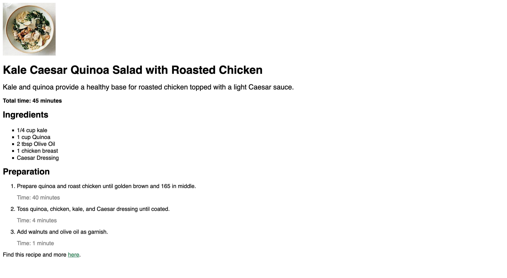

# HEALTHY RECIPE

## Table of contents

- [✅ Project completed](#project-completed-repo)
- [⌛️ Project starter](#project-starter-repo)
- [🧩 Concepts](#concepts-to-review-for-this-project)
- [🎯 Learning goal](#learning-goal)
- [💻 Application Overview](#overview)
  - [📸Screenshot](#screenshot)
  - [🥷🏽 The challenge](#the-challenge)
  - [🔗Links](#links)
- [🪜 Tasks](#tasks)
- [Built with](#built-with)
- [📕 What I learned](#what-i-learned)
- [⏭️ Continued development](#continued-development)
- [📚 Useful resources](#useful-resources)

## Project completed repo

- check out the code here `->` [completed](https://github.com/hermkan/code-journey-css/tree/main/01-healthy-recipe/completed)

## Project starter repo

- check out the code here `->` [starter](https://github.com/hermkan/code-journey-css/tree/main/01-healthy-recipe/starter)

## Concepts to review for this project

- CSS selectors

## Learning Goal

- Apply knowledge of CSS selectors, to give a recipe website some new style!

## Overview

### Screenshot

### The challenge

The challenge is to build out this page and get it looking as close to the design as possible.
Some styling was added to the page in `style.css`

### Links

- Live Site URL: [Healthy Recipes](https://code-journey-css-css-selectors.vercel.app/)

## Tasks

1. Start by making the image at the top of the page a little smaller. Write a CSS selector for the img tag and give it a height of 150px

2. The font size of the recipe description should be larger. In style.css, write a CSS selector for the `.description` class and change the font size to `20px`.

3. Style the cooking time. Add a cook-time ID selector and change the font weight to bold

4. Change the bullet points of the ingredient list to squares instead of circles.

5. Make the time for each preparation step appear gray.

6. Let’s make the link at the bottom of the page a different color. change the color to `seagreen`

7. Write a selector that applies a font-family attribute to the h1, h2, p, and li elements at once. Change their font to `Helvetica`

## Built with

- Semantic HTML5 markup
- CSS

## What I learned

## Continued development

## Useful resources
